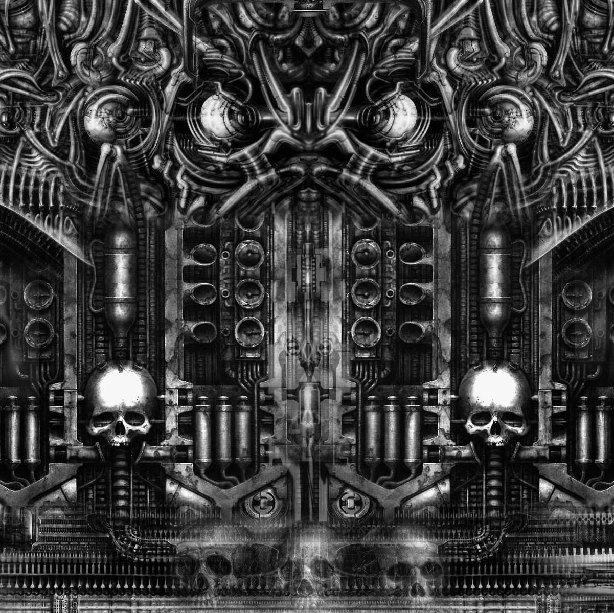
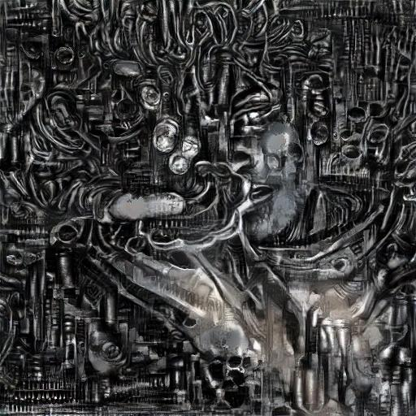
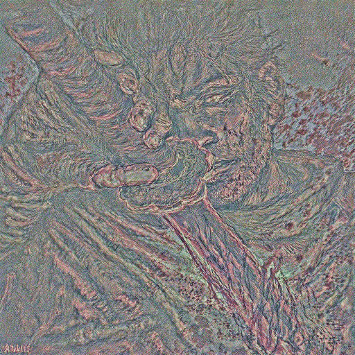
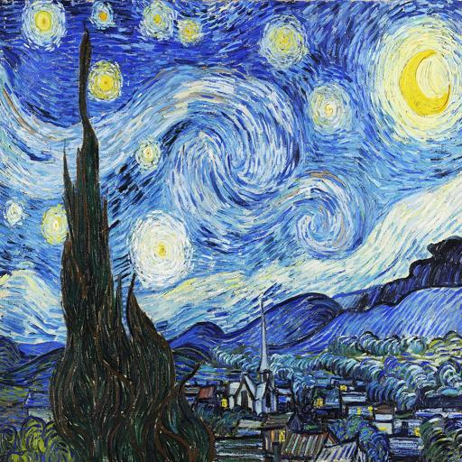
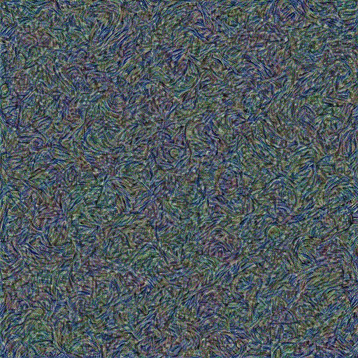
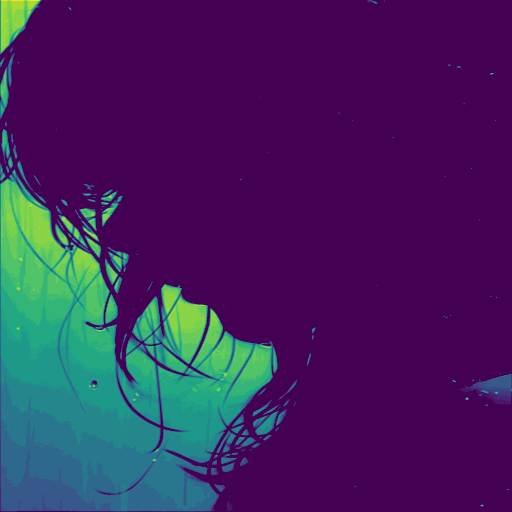
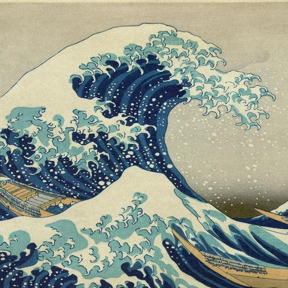
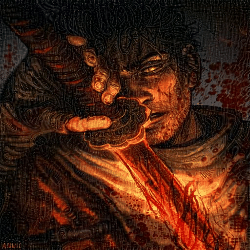

<!-- # Paper Link : [link](https://arxiv.org/abs/1508.06576) -->


# 🖼️ Neural Style Transfer  

This project implements the Neural Style Transfer (NST) algorithm using PyTorch, which applies the artistic style of one image to the content of another by leveraging a pre-trained VGG19 , VGG16 models to extract features, optimize a target image, and produce a new, stylized image.

<table align="center" cellpadding="20">
  <tr>
    <td align="center" style="padding-right: 40px;">
      <br/>
      <strong>Content 🖼️</strong><br/><br/>
      <span style="font-size: 24px;">➕</span><br/><br/>
      <br/>
      <strong>Style 🎨</strong>
    </td>
    <td align="center" style="font-size: 32px; padding: 0 40px;">
      <strong>=</strong>
    </td>
    <td align="center" style="padding-left: 40px;">
      <br/>
      <strong>Stylized Output 🧠🖌️</strong>
    </td>
  </tr>
</table>

## What is Neural Style Transfer?

Neural Style Transfer (NST) is a technique introduced by Gatys _et al._ (2015) that combines the **content** of one image with the **style** of another.  
- **Content image**: preserves the high‑level structure (objects, layout)  
- **Style image**: supplies colors, textures, brushstrokes  

This repo extends NST to include pure content and style reconstructions, plus feature‐level visualization of pre‑trained VGG features.

Original paper: “A Neural Algorithm of Artistic Style”  
https://arxiv.org/abs/1508.06576


## Installation

```bash
# Clone the repository
git clone https://github.com/yourusername/neural-style-transfer.git
cd neural-style-transfer

# Install dependencies
pip install -r requirements.txt
```

## Usage

Once cloned and dependencies are installed, run any mode via:

```bash
python run.py <mode> [options]
```

### Common Flags

```
--model_type vgg16 | vgg19
--image_size <int> (default 512)
--iterations <int> (default 100)
--lr <float> (default 1)
--optimizer lbfgs | adam
--tv_weight <float> (default 1e-3)
--noise_scale <float> (default 0.1)
--show_images
```

## Examples

### 1. Content Reconstruction

Reconstruct the content features from a specific layer of the network.

<table align="center" style="border-collapse: collapse; text-align: center;">
  <tr>
    <td style="padding: 10px;">
      
    </td>
    <td style="padding: 10px; vertical-align: middle; font-size: 32px;">➡️</td>
    <td style="padding: 10px;">
      
    </td>
  </tr>
</table>


```bash
# For higher layers use --use_content_init for better results
python run.py content --content_image "data\content\firy.jpg" --target_layer 20 --use_content_init --iterations 200 --lr 1.0 --optimizer lbfgs --tv_weight 1e-3 --noise_scale 0.1
```

### 2. Style Reconstruction

Reconstruct the style features from multiple layers of the network.

<table align="center" style="border-collapse: collapse; text-align: center;">
  <tr>
    <td style="padding: 10px;">
      
    </td>
    <td style="padding: 10px; vertical-align: middle; font-size: 32px;">➡️</td>
    <td style="padding: 10px;">
      
    </td>
  </tr>
</table>


```bash
python run.py style --style_image data/styles/style.jpg --init_method noise --style_weight 1e3 --iterations 100 --lr 1 --optimizer lbfgs --tv_weight 1e-3 --noise_scale 0.1 
```


### 3. Feature Visualization

Visualize the features learned by specific layers of the network.

<table align="center" style="border-collapse: collapse; text-align: center;">
  <tr>
    <td style="padding: 10px;">
      
    </td>
    <td style="padding: 10px; vertical-align: middle; font-size: 32px;">➡️</td>
    <td style="padding: 10px;">
      
    </td>
  </tr>
</table>


```bash
python run.py visualize --image data\content\rain.jpg --target_layer 1

```

### 4. Neural Style Transfer

Combine the content of one image with the style of another.

```bash
python run.py nst --content_image data/contents/content.jpg --style_image data/styles/style.jpg --content_layer 21 --content_weight 1 --style_weight 1e5 --init_method content_with_noise --iterations 500 --lr 1.0 --optimizer lbfgs --tv_weight 1e-2 
```
## Examples of NST:

<table align="center" style="border-collapse: collapse; text-align: center;">
  <tr>
    <th style="padding: 10px;">Content</th>
    <th style="padding: 10px;">Style</th>
    <th style="padding: 10px;">NST (content initialized)</th>
  </tr>

  <!-- Row 1 -->
  <tr>
    <td style="padding: 10px;">
      
    </td>
    <td style="padding: 10px;">
      
    </td>
    <td style="padding: 10px;">
      
    </td>
  </tr>

  <!-- Row 2 -->
  <tr>
    <td style="padding: 10px;">
      
    </td>
    <td style="padding: 10px;">
      
    </td>
    <td style="padding: 10px;">
      
    </td>
  </tr>
</table>


## Acknowledgements

This implementation is based on the paper [A Neural Algorithm of Artistic Style](https://arxiv.org/abs/1508.06576) by Gatys et al.

## License

[](LICENSE)